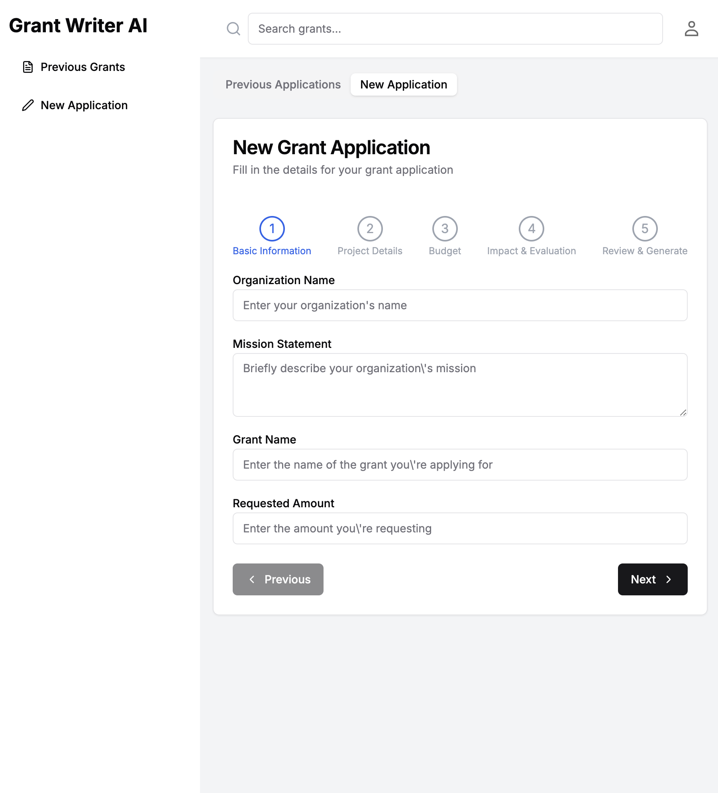

## Elevator Pitch:
Nonprofits spend time and money on writing grants that often don't come to fruitiion.
My product will utilize AI to help them better organize their thoughts, and reduce turnaround time on their writing. Allowing them to focus more on their missions and less on fundraising.

## Key Features:
- User accounts
- A guided process to help nonprofits organize their thoughts
- A database of anonymized successful grant applications to help guide the writing process
- AI generated applications based on the user's input
- Ability to see their past applications
## Technology Specification

- **HTML**: Structure for login, dashboard, application process, and past applications pages.

- **CSS**: Responsive design, professional color scheme, accessible styling.

- **JavaScript**: Dynamic content loading, interactivity for guided process.

- **React**: SPA architecture, componentized UI, state management for user progress.

- **Web Service**:
    - API endpoints for user auth, application CRUD operations, AI suggestions.
    - External API: OpenAI's GPT for generating grant content.

- **Authentication**: User registration, login, JWT sessions, display user info post-login.

- **Database**: Store user profiles, and previous applications.

- **WebSocket**: Livestream AI-generated content to the user interface, showing real-time typing effect as the AI writes.

## Deliverables Sep 28
- I learned how to deploy code to AWS
- I learned how to build out a basic html app
- I updated my project to have a bunch of HTML pages
- I gave those pages scaffolding for the content I want to add
- I provided links to each page with a navbar
- I served my github links to the footer

## Deliverables Oct 12
- I learned how to organize elements with css
- I learned how to get a better font for my site
- I learned how to style elements with css
- I learned how to use grids
- I learned how to use css for image manipulation
- I learned how much better css makes a site look

## Startup react learnings
- i learned how to deploy a react app to AWS
- i learned how to convert html to vite
- i learned we need the base index.html for the page to initially inject all our stuff
- 